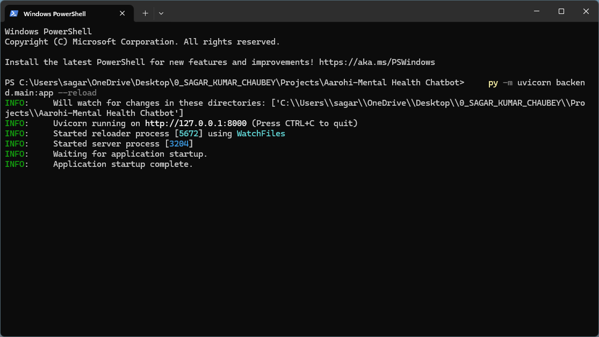
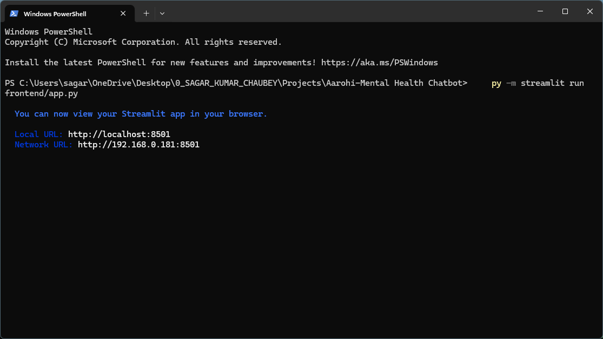
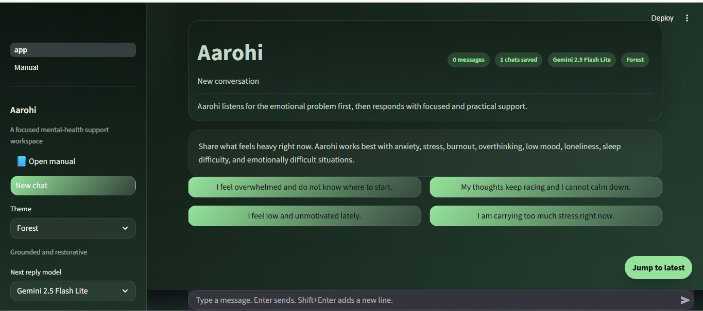
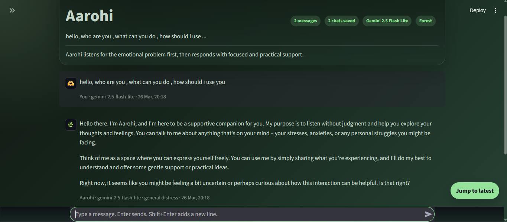

# Aarohi — AI Mental Health Support System

> A focused, emotionally intelligent mental health support chatbot built with FastAPI, Streamlit, and the Google Gemini API.

---

## Table of Contents

- [Overview](#overview)
- [Screenshots](#screenshots)
- [Features](#features)
- [Tech Stack](#tech-stack)
- [Project Structure](#project-structure)
- [Prerequisites](#prerequisites)
- [Installation](#installation)
- [Configuration](#configuration)
- [Running the Application](#running-the-application)
- [API Reference](#api-reference)
- [Safety System](#safety-system)
- [Available Models](#available-models)
- [Themes](#themes)
- [Troubleshooting](#troubleshooting)
- [Disclaimer](#disclaimer)

---

## Overview

Aarohi is a production-oriented mental health support chatbot that acts as an emotionally intelligent companion. It is intentionally scoped to mental health conversations — it listens for the emotional context first, then responds with focused, practical support grounded in guidance from WHO, NIMH, NHS, and SAMHSA.

Aarohi is **not** a general-purpose assistant. It redirects unrelated prompts back to the emotional support context, maintaining a consistent and safe therapeutic tone throughout every conversation.

---

## Screenshots

### 1. Backend Server — FastAPI Running



The FastAPI backend is started with `uvicorn` and runs on `http://localhost:8000`. The terminal confirms the reloader process is active, the server process has started, and the application startup is complete.

---

### 2. Frontend Server — Streamlit Running



The Streamlit frontend is started in a separate terminal and becomes available at `http://localhost:8501` (local) and the LAN network address. Both the backend and frontend must be running simultaneously for the app to function.

---

### 3. Aarohi Chat Interface — Home Screen



The main chat interface features a clean dark UI with the **Forest** theme active. The left sidebar shows theme selection, model selection, and saved chat history. The welcome panel displays quick-start prompts covering common emotional struggles including overwhelm, racing thoughts, low mood, and stress.

---

### 4. Aarohi in Conversation



An active session showing Aarohi's response style. Aarohi introduces itself as a supportive companion, listens without judgment, and gently checks in with the user before offering guidance. Each message is timestamped and tagged with the model and detected emotional category (e.g., `general distress`).

---

## Features

- **Emotion-first response logic** — Aarohi attempts to understand the user's likely struggle before offering coping options
- **Evidence-informed guidance** — responses grounded in WHO, NIMH, NHS, and SAMHSA mental health frameworks
- **Mandatory crisis override** — self-harm related phrases bypass the model entirely and return a direct crisis support response
- **Per-reply model switching** — users can switch between Gemini models from the sidebar without restarting the app
- **Multiple visual themes** — Forest, Lake, Waterfall, Volcano, Dragon, Lotus
- **Persistent chat history** — conversations saved to `data/chat_history.json` and accessible across sessions
- **Session memory** — context is maintained within a conversation using a sliding history window
- **Model discovery caching** — available Gemini models are fetched once and cached (TTL: 600 seconds) to reduce API overhead
- **Modular backend architecture** — services, schemas, safety, history, and model management are separated into individual modules
- **Scope enforcement** — off-topic requests are redirected back to mental health context

---

## Tech Stack

| Layer | Technology |
|---|---|
| Backend API | FastAPI 0.116.1 |
| ASGI Server | Uvicorn 0.35.0 (with standard extras) |
| Frontend UI | Streamlit 1.49.0 |
| AI Model | Google Gemini API (2.5 series) |
| HTTP Client | Requests 2.32.5 |
| Data Validation | Pydantic 2.11.7 |
| Config Management | python-dotenv 1.1.1 |
| History Storage | JSON flat-file (`data/chat_history.json`) |
| Language | Python 3.11+ |

---

## Project Structure

```
Aarohi-Mental-Health-Chatbot/
│
├── backend/
│   ├── __init__.py          # Package init
│   ├── config.py            # Environment config and settings
│   ├── gemini_service.py    # Gemini API communication layer
│   ├── guidance_library.py  # Evidence-based mental health guidance content
│   ├── history_store.py     # Chat history read/write to JSON
│   ├── main.py              # FastAPI app, route definitions
│   ├── model_manager.py     # Gemini model discovery and caching
│   ├── safety.py            # Crisis keyword detection and override logic
│   └── schemas.py           # Pydantic request/response models
│
├── frontend/
│   ├── app.py               # Main Streamlit chat interface
│   └── pages/
│       └── 1_Manual.py      # In-app user manual page
│
├── data/
│   └── chat_history.json    # Persistent conversation storage
│
├── screenshots/             # Sample Screenshots are here
│
├── .env.example             # Environment variable template
├── .env                     # Your local config (not committed)
├── requirements.txt         # Python dependencies
├── WALKTHROUGH.txt          # Detailed step-by-step run guide
└── README.md
```

---

## Prerequisites

- Python **3.11 or newer**
- A valid **Google Gemini API key** — obtain one from [Google AI Studio](https://aistudio.google.com/)
- An active internet connection (required for Gemini API calls and model discovery)

---

## Installation

**1. Clone the repository**

```bash
git clone https://github.com/sagarkrchaubey/Aarohi-Mental-Health-Chatbot.git
cd Aarohi-Mental-Health-Chatbot
```

**2. Create and activate a virtual environment**

Windows (PowerShell):
```powershell
py -m venv .venv
.\.venv\Scripts\Activate.ps1
```

macOS / Linux:
```bash
python3 -m venv .venv
source .venv/bin/activate
```

**3. Install dependencies**

Windows:
```powershell
py -m pip install -r requirements.txt
```

macOS / Linux:
```bash
pip install -r requirements.txt
```

---

## Configuration

Copy the example environment file and populate your API key:

Windows (PowerShell):
```powershell
Copy-Item .env.example .env
```

macOS / Linux:
```bash
cp .env.example .env
```

Open `.env` and set the following values:

```env
GEMINI_API_KEY=your_gemini_api_key_here
GEMINI_API_URL=https://generativelanguage.googleapis.com/v1beta/models
REQUEST_TIMEOUT_SECONDS=18
REQUEST_MAX_RETRIES=1
MODEL_CACHE_TTL_SECONDS=600
HISTORY_WINDOW_SIZE=6
MAX_OUTPUT_TOKENS=260
AAROHI_API_BASE_URL=http://localhost:8000
```

| Variable | Description |
|---|---|
| `GEMINI_API_KEY` | Your Google Gemini API key (required) |
| `GEMINI_API_URL` | Gemini REST endpoint base URL |
| `REQUEST_TIMEOUT_SECONDS` | HTTP timeout per Gemini API call |
| `REQUEST_MAX_RETRIES` | Number of retries on transient failures |
| `MODEL_CACHE_TTL_SECONDS` | How long to cache the discovered model list |
| `HISTORY_WINDOW_SIZE` | Number of prior turns included in each request |
| `MAX_OUTPUT_TOKENS` | Maximum token length of each Aarohi reply |
| `AAROHI_API_BASE_URL` | URL that the Streamlit frontend calls |

---

## Running the Application

Aarohi requires **two separate terminals** running simultaneously.

### Terminal 1 — Start the Backend

```powershell
# Windows
py -m uvicorn backend.main:app --reload
```
```bash
# macOS / Linux
python -m uvicorn backend.main:app --reload
```

The backend will be available at: `http://localhost:8000`

Verify it is running: open `http://localhost:8000/health` — you should see `{"status":"ok"}`.

---

### Terminal 2 — Start the Frontend

Activate the virtual environment again, then:

```powershell
# Windows
py -m streamlit run frontend/app.py
```
```bash
# macOS / Linux
python -m streamlit run frontend/app.py
```

The frontend will be available at: `http://localhost:8501`

> ⚠️ **Always start the backend first.** The frontend makes API calls to the backend on startup to fetch the model list.

---

## API Reference

### `GET /health`

Returns the health status of the backend service.

**Response:**
```json
{ "status": "ok" }
```

---

### `GET /models`

Fetches available Gemini models dynamically from the Google API and returns curated display metadata for the frontend dropdown. Results are cached for `MODEL_CACHE_TTL_SECONDS` seconds.

---

### `POST /chat`

Sends a user message and returns Aarohi's response.

**Request body:**
```json
{
  "message": "I've been feeling exhausted and anxious lately.",
  "model": "gemini-2.5-flash-lite",
  "session_id": "session-abc123"
}
```

**Response:**
```json
{
  "reply": "...",
  "session_id": "session-abc123",
  "model_used": "gemini-2.5-flash-lite",
  "category": "anxiety"
}
```

| Field | Description |
|---|---|
| `message` | The user's input text |
| `model` | Gemini model identifier to use for this reply |
| `session_id` | Session identifier for history retrieval |

---

## Safety System

Aarohi includes a mandatory crisis override that activates before any model call is made. If the incoming message contains any of the following phrases, the model is **not called** and a direct crisis support response is returned instead:

- `suicide`
- `kill myself`
- `end my life`

This override cannot be bypassed by framing, prompt injection, or model selection. The safety check is implemented in `backend/safety.py` and runs as the first step in the `/chat` route handler.

---

## Available Models

| Model | Notes |
|---|---|
| `gemini-2.5-flash-lite` | Default UI model — fast, efficient, recommended for most sessions |
| `gemini-2.5-flash` | Balanced performance and quality |
| `gemini-2.5-pro` | Highest capability; slower response times |
| `gemini-2.0-*` | Legacy; may not work reliably — shown only if discovered |

The active model can be changed per-reply from the **Next reply model** dropdown in the sidebar without restarting the app.

---

## Themes

The frontend ships with six visual themes selectable from the sidebar:

| Theme | Description |
|---|---|
| **Forest** | Deep greens — grounded and restorative |
| **Lake** | Cool blues — calm and reflective |
| **Waterfall** | Teal and mist — flowing and tranquil |
| **Volcano** | Warm reds and oranges — energetic release |
| **Dragon** | Dark purples — intense and focused |
| **Lotus** | Soft pinks — gentle and nurturing |

---

## Troubleshooting

**`uvicorn` or `streamlit` not recognized**

Use the module invocation form instead:
```bash
py -m uvicorn backend.main:app --reload
py -m streamlit run frontend/app.py
```

**API key error on startup**

- Confirm `.env` exists at the project root (not inside `backend/`)
- Confirm `GEMINI_API_KEY` is set to a valid key with no extra spaces or quotes
- Restart the backend after editing `.env`

**Frontend loads but chat does not respond**

- Confirm the FastAPI backend is running on port 8000
- Open `http://localhost:8000/health` in a browser to verify
- Check that `AAROHI_API_BASE_URL` in `.env` matches the backend address

**Model list does not appear in the sidebar**

- Verify your internet connection
- Verify your Gemini API key has access to the Gemini 2.5 model family
- Restart the backend to clear the model cache

**Old UI still appears after code changes**

- Stop the Streamlit process (`Ctrl+C`)
- Restart with `py -m streamlit run frontend/app.py`
- Hard-refresh the browser (`Ctrl+Shift+R`)

---

## Disclaimer

Aarohi is a software project built for educational and demonstrative purposes. It is **not** a licensed medical device, clinical tool, or substitute for professional mental health care. If you or someone you know is experiencing a mental health crisis, please contact a qualified healthcare professional or a crisis helpline in your region.

---

*Built by [Sagar Kumar Chaubey](https://github.com/sagarkrchaubey)*
